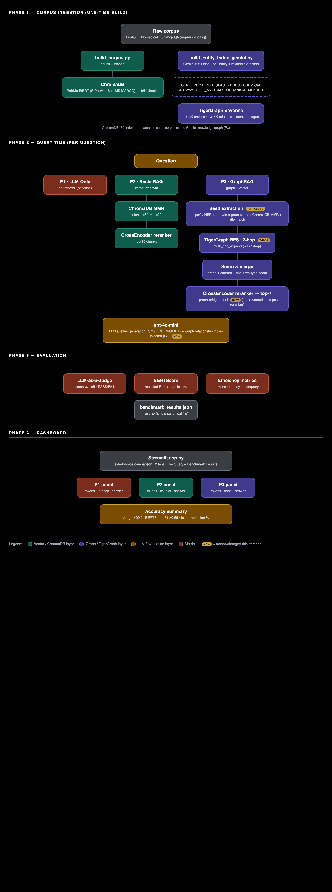

# GraphRAG vs Basic RAG — Token-Efficient LLM Inference on TigerGraph

**TigerGraph GraphRAG Inference Hackathon.** Three pipelines answer the same biomedical
questions; the numbers tell the story: **GraphRAG cuts tokens ~50% vs Basic RAG while
*improving* accuracy.**

## 🏆 Headline — BioASQ (biomedical multi-hop QA)

| Pipeline | LLM-as-a-Judge | BERTScore | Avg tokens |
|---|---|---|---|
| P1 — LLM-Only | 90% | 0.388 | 182 |
| P2 — Basic RAG | 86% | 0.355 | 3,375 |
| **P3 — GraphRAG (TigerGraph)** | **94%** | **0.404** | **1,725 (−49%)** |

Basic RAG (vector) actually trails the raw LLM here (86% vs 90%) — vector search retrieves
similar chunks but can't reason across relationships. **GraphRAG's multi-hop graph traversal
lifts accuracy to 94% at half the tokens** — capturing what vector search misses.

## The three pipelines

| | Pipeline | How it works |
|---|---|---|
| **P1** | LLM-Only | Prompt in, answer out. No retrieval. Worst-case baseline. |
| **P2** | Basic RAG | ChromaDB vector retrieval + cross-encoder rerank → LLM. The baseline to beat. |
| **P3** | **GraphRAG** | Gemini-extracted knowledge graph in **TigerGraph Savanna** → multi-hop BFS + entity-seeded retrieval + rerank → LLM synthesis. |

## Architecture



Corpus → **ChromaDB** (P2 index) and → **Gemini KG extraction** → **TigerGraph Savanna** (P3 graph).
Full source for the diagram: [`architecture.html`](architecture.html).

## Setup

```bash
python -m venv .venv && source .venv/bin/activate
pip install -r requirements.txt
python -m spacy download en_core_web_sm
cp .env.example .env          # then fill in the keys
```

**Keys in `.env`:** `OPENAI_API_KEY` (answering LLM, gpt-4o-mini) · `HF_TOKEN` (LLM-judge) ·
`GOOGLE_API_KEY` (Gemini KG extraction) · `TIGERGRAPH_HOST` / `TIGERGRAPH_SECRET` (Savanna).
Get a free TigerGraph Savanna instance at [tgcloud.io](https://tgcloud.io).

## Run the full pipeline

```bash
# 1. Build the corpus + ChromaDB vector index (Pipeline 2)
DATASET=bioasq python build_corpus.py

# 2. Extract the knowledge graph with Gemini (Pipeline 3) — resumable + checkpointed
DATASET=bioasq GEMINI_INDEX_DIR=pipeline3_bioasq/index python build_entity_index_gemini.py

# 3. Ingest the KG into TigerGraph Savanna
TG_INDEX_DIR=pipeline3_bioasq/index TIGERGRAPH_GRAPH=bioasq \
  python tigergraph_cloud_ingest.py --fresh

# 4. Run the 3-pipeline benchmark (LLM-judge + BERTScore + tokens/latency)
DATASET=bioasq python run_benchmark.py

# 5. Launch the side-by-side comparison dashboard
streamlit run app.py
```

## Dashboard

`streamlit run app.py` opens an interactive comparison dashboard with two tabs:

- **Live Query** — type any question; all three pipelines answer it live and show their
  answers + per-query tokens, latency, cost, and chunks retrieved, side by side.
- **Benchmark Results** — loads `results/benchmark_results.json` (written by every
  `run_benchmark.py` run) and renders the full comparison: accuracy (LLM-judge + BERTScore),
  token/latency charts, the BERTScore distribution, and per-question breakdowns.

## Evaluation (per the hackathon spec)

- **LLM-as-a-Judge** — `meta-llama/Llama-3.1-8B-Instruct` returns PASS/FAIL per answer.
- **BERTScore** — semantic similarity to the reference answer (`rescale_with_baseline=True`).
- **Cost** — prompt + completion tokens, latency, and $/query per pipeline.

Implemented in [`accuracy.py`](accuracy.py) and [`metrics.py`](metrics.py).

## Repository layout

```
config.py                      central config + per-dataset paths
main.py                        3-pipeline benchmark orchestration
run_benchmark.py               dataset-configurable entry point
app.py                         Streamlit comparison dashboard
accuracy.py / metrics.py       evaluation + cost tracking
llm_client.py                  LLM provider wrapper
chroma_store.py                ChromaDB build/query (Pipeline 2)
build_corpus.py                corpus + ChromaDB builder
build_entity_index_gemini.py   Gemini KG extraction (Pipeline 3)
tigergraph_cloud_ingest.py     TigerGraph Savanna schema + ingest
pipeline1_llm_only.py          Pipeline 1
pipeline2_basic_rag.py         Pipeline 2
pipeline3_tigergraph_cloud/    Pipeline 3 (GraphRAG retrieval + synthesis)
data/  embeddings/             dataset loaders + embedder
```

> Large generated artifacts (`chroma_db_bioasq/`, `pipeline3_bioasq/index/`) are gitignored —
> regenerate them with steps 1–2 above.

## Credits

Pipeline 3 is built on the [TigerGraph GraphRAG](https://github.com/tigergraph/graphrag) approach,
running on **TigerGraph Savanna**. Dataset: [`rag-mini-bioasq`](https://huggingface.co/datasets/enelpol/rag-mini-bioasq).
